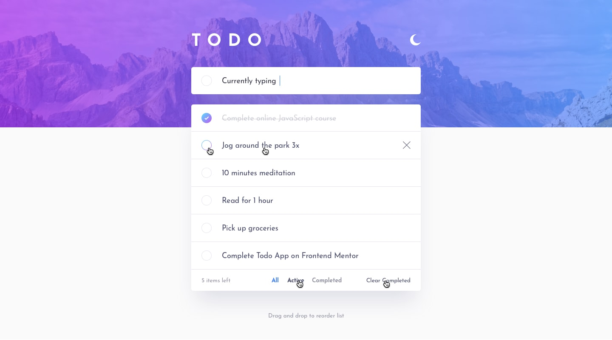

# Todo List App
[](https://app.netlify.com/sites/todoalberton/deploys)

## About


This is a simple todo-list app created to training skills and test [Vite.js](https://vitejs.dev) a tool to use the native Es Module to "bundle" the app in a fast way.  

Click in this link to access the live app hosted on Netlify https://todoalberton.netlify.app/  

This design was inpired by [Todo app challenge on Frontend Mentor](https://www.frontendmentor.io/challenges/todo-app-Su1_KokOW).


  
  
### Technologies
- React
- Typescript
- Vite
- Stitches.css
- Context API
- Redux
- Jest

## Getting started
```
git pull https://github.com/jonasalberton/todo-list.git
cd todo-list
npm i
npm run dev
```
